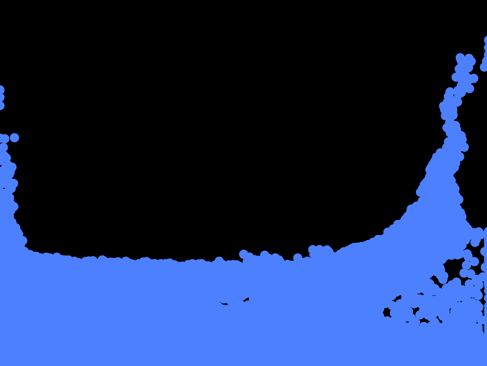
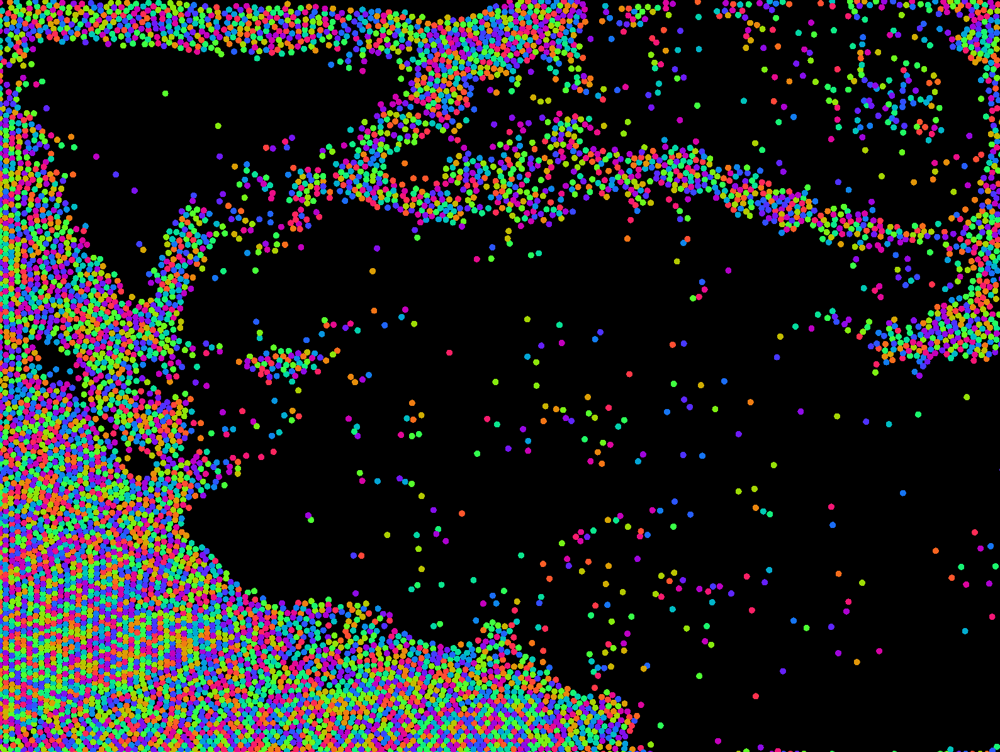

## Basic physics engine

This is my first rust project, i just wanted to try rust :)

### Compile and run

```bash
RUSTFLAGS="-C target-cpu=native" cargo build --release && target/release/glfw_example
```

### Hotkeys

- `space` - add some particles by hand
- `g` - emit more particles
- `wasd / arrows` - change gravity

### Screenshots



